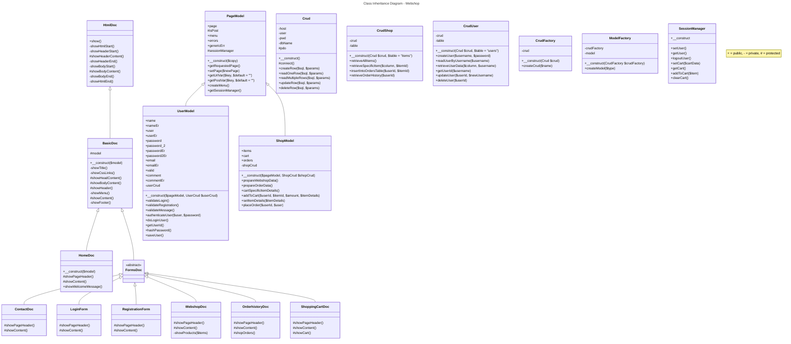

```mermaid
---
title: Class Inheritance Diagram - Webshop
---
classDiagram
    note "+ = public, - = private, # = protected"
    %% A <|-- B means that class B inherits from class A %%
    HtmlDoc <|-- BasicDoc

    BasicDoc <|-- HomeDoc
    BasicDoc <|-- FormsDoc

    FormsDoc <|-- ContactDoc
    FormsDoc <|-- LoginForm
	FormsDoc <|-- RegistrationForm
	
	FormsDoc <|-- WebshopDoc
    FormsDoc <|-- OrderhistoryDoc
	FormsDoc <|-- ShoppingCartDoc

    PageModel <|-- UserModel
    PageModel <|-- ShopModel

    class HtmlDoc{
       +show()
       -showHtmlStart()
       -showHeaderStart()
       #showHeaderContent()
       -showHeaderEnd()
       -showBodyStart()
       #showBodyContent()
       -showBodyEnd()
       -showHtmlEnd()
    }
    class BasicDoc{
        #model 
        +__construct($model)
        -showTitle()
        -showCssLinks()
        #showHeadContent()
        #showBodyContent()
        #showHeader()
        -showMenu()
        #showContent()
        -showFooter()
    }
    class HomeDoc{
        +__construct($model)
        #showPageHeader()
        #showContent()
        +showWelcomeMessage()
    }	
    class FormsDoc{
        <<abstract>>
    }
    class ContactDoc{
        #showPageHeader()
        #showContent()
    }
    class LoginForm{
        #showPageHeader()
        #showContent()
    }
	class RegistrationForm{
		#showPageHeader()
		#showContent()
	}
	class WebshopDoc{
        #showPageHeader()
        #showContent()
        -showProducts($items)
	}
    class OrderhistoryDoc{
        #showPageHeader()
        #showContent()
        #shopOrders()

    }
	class ShoppingCartDoc{
        #showPageHeader()
        #showContent()
        #showCart()
	}

    %%no inheritance happening:

    class Crud{
		-host
		-user
		-pwd
        -dbName
        #pdo
		+__construct()
		#connect()
		+createRow($sql, $params)
		+readOneRow($sql, $params)
        +readMultipleRows($sql, $params)
        +updateRow($sql, $params)
        +deleteRow($sql, $params)
	}
    class CrudShop{
        -crud
        -table
        +__construct(Crud $crud, $table = "items")
        +retrieveAllItems()
        +retrieveSpecificItem($column, $itemId)
        +insertIntoOrdersTable($userId, $itemId)
        +retrieveOrderHistory($userId)
    }
    class CrudUser{
        -crud
        -table
        +__construct(Crud $crud, $table = "users")
        +createUser($username, $password)
        +readUserByUsername($username)
        +retrieveUserData($column, $username)
        +getUserId($username)
        +updateUser($userId, $newUsername)
        +deleteUser($userId)
    }
    class CrudFactory{
        -crud
        +__construct(Crud $crud)
        +createCrud($name)
    }
    class ModelFactory{
        -crudFactory
        -model
        +__construct(CrudFactory $crudFactory)
        +createModel($type)
    }

    class SessionManager {
        +__construct
        +setUser()
        +getUser()
        +logoutUser()
        +setCart($cartData)
        +getCart()
        +addToCart($item)
        +clearCart()
    }

    class PageModel {
        +page
        #isPost
        +menu
        +errors
        +genericErr
        #sessionManager
        +__construct($copy)
        +getRequestedPage()
        +setPage($newPage)
        +getUrlVar($key, $default = "")
        +getPostVar($key, $default = "")
        +createMenu()
        +getSessionManager()
    }
    class ShopModel {
        +items
        +cart
        +orders
        -shopCrud
        +__construct($pageModel, ShopCrud $shopCrud)
        +prepareWebshopData()
        +prepareOrderData()
        +cartSpecificItemDetails()
        +addToCart($userId, $itemId, $amount, $itemDetails)
        +setItemDetails($itemDetails)
        +placeOrder($userId, $user)
    }
    class UserModel {
        +name
        +nameEr
        +user
        +userEr
        +password
        +password_2
        +passwordEr
        +password2Er
        +email
        +emailEr
        +valid
        +comment
        +commentEr
        -userCrud
        +__construct($pageModel, UserCrud $userCrud)
        +validateLogin()
        +validateRegistration()
        +validateMessage()
        +authenticateUser($user, $password)
        +doLoginUser()
        +getUserId()
        +hashPassword()
        +saveUser()
    }


```
