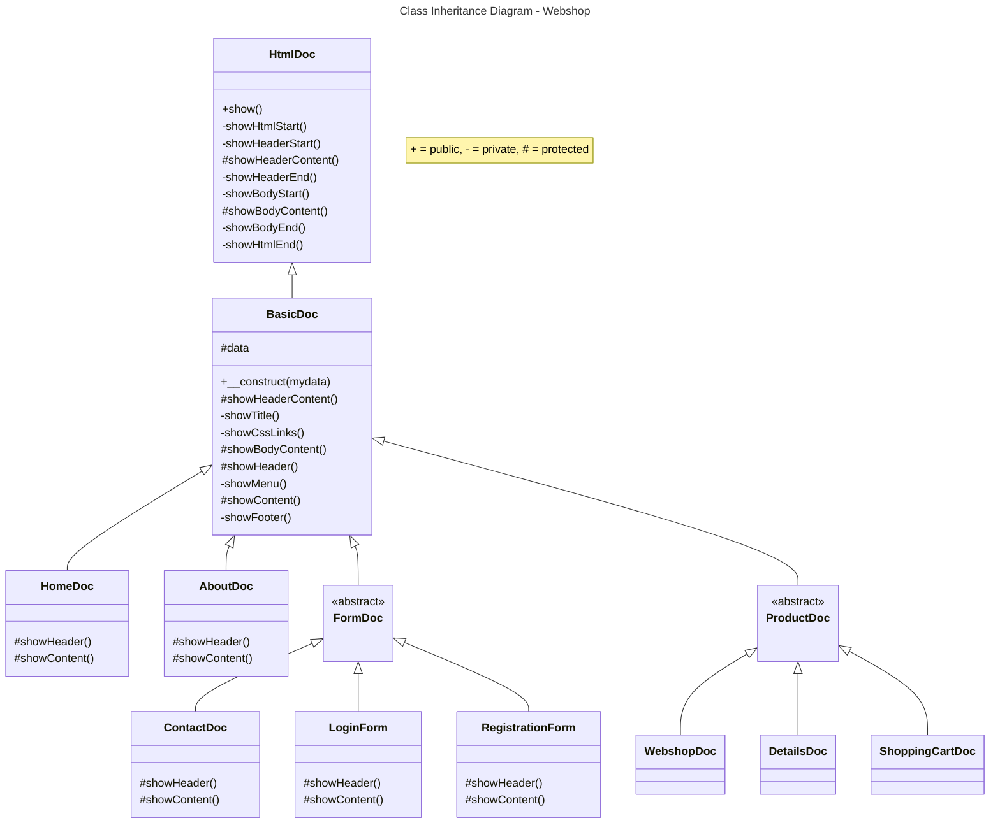

```mermaid
---
title: Class Inheritance Diagram - Webshop
---
classDiagram
    note "+ = public, - = private, # = protected"
    %% A <|-- B means that class B inherits from class A %%
    HtmlDoc <|-- BasicDoc

    BasicDoc <|-- HomeDoc
    BasicDoc <|-- AboutDoc
    BasicDoc <|-- FormDoc
	BasicDoc <|-- ProductDoc

    FormDoc <|-- ContactDoc
    FormDoc <|-- LoginForm
	FormDoc <|-- RegistrationForm
	
	ProductDoc <|-- WebshopDoc
	ProductDoc <|-- DetailsDoc
	ProductDoc <|-- ShoppingCartDoc

    class HtmlDoc{
       +show()
       -showHtmlStart()
       -showHeaderStart()
       #showHeaderContent()
       -showHeaderEnd()
       -showBodyStart()
       #showBodyContent()
       -showBodyEnd()
       -showHtmlEnd()
    }
    class BasicDoc{
        #data 
        +__construct(mydata)
        #showHeaderContent()
        -showTitle()
        -showCssLinks()
        #showBodyContent()
        #showHeader()
        -showMenu()
        #showContent()
        -showFooter()
    }
    class HomeDoc{
        #showHeader()
        #showContent()
    }
    class AboutDoc{
        #showHeader()
        #showContent()
    }
    class FormDoc{
        <<abstract>>
    }
	class ProductDoc{
		<<abstract>>
	}
    class ContactDoc{
        #showHeader()
        #showContent()
    }
    class LoginForm{
        #showHeader()
        #showContent()
    }
	class RegistrationForm{
		#showHeader()
		#showContent()
	}
	class WebshopDoc{
		
	
	}
	class DetailsDoc{
	
	
	}
	class ShoppingCartDoc{
	
	
	}

```
